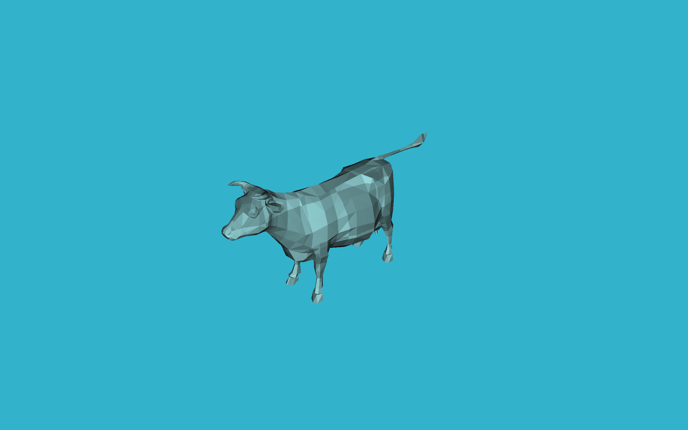
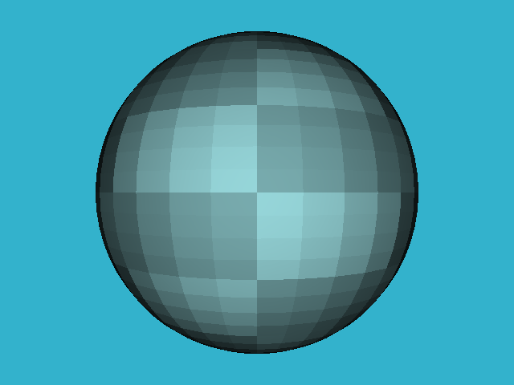

# myGL
1. The simplest ray tracer is finished in v0.1, and it can be downloaded in https://github.com/hudongyue1/myGL/archive/refs/tags/lesson.zip
  
  The related post is https://hudongyue.com/2022/12/15/Scratchapixel-Simple-Ray-Tracing/
  
  It can render the image like:

  

2. The ray tracer v0.2, and it can support to render the triangle mesh. It can be downloaded in https://github.com/hudongyue1/myGL/releases/tag/lesson1
  
  With a mesh model, it can triangulate it at first, then it can render it like:

  

Adding the choice for **Flat Shading** and **Smooth Shading**:

<table frame=void>	<!--用了
进行封装-->
	<tr>
        <td>

	<!--每个格子内是图片加标题-->
        		<!--高度设置-->
        	Flat-Shading	<!--标题1-->
        

</td>    
     	<td>

	<!--第二张图片-->
    			
    		Smooth-Shading
        

</td>
	</tr>
</table>

