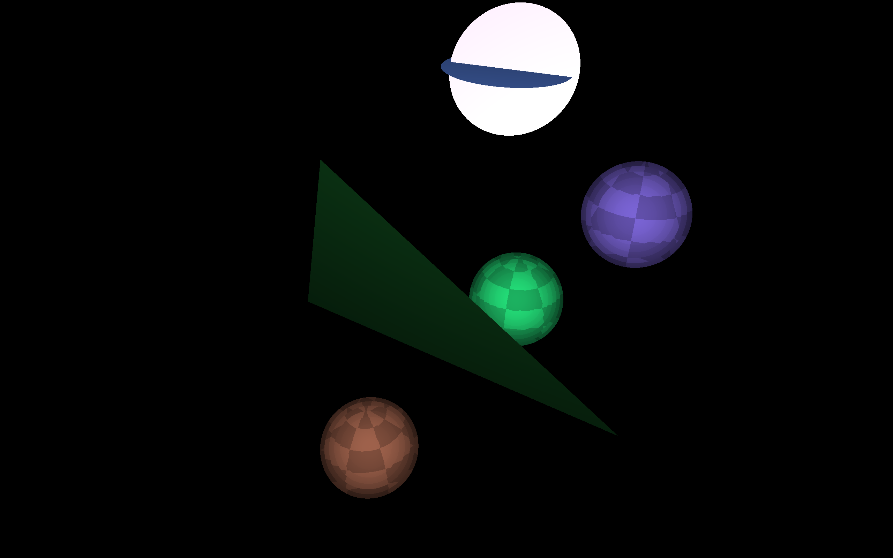
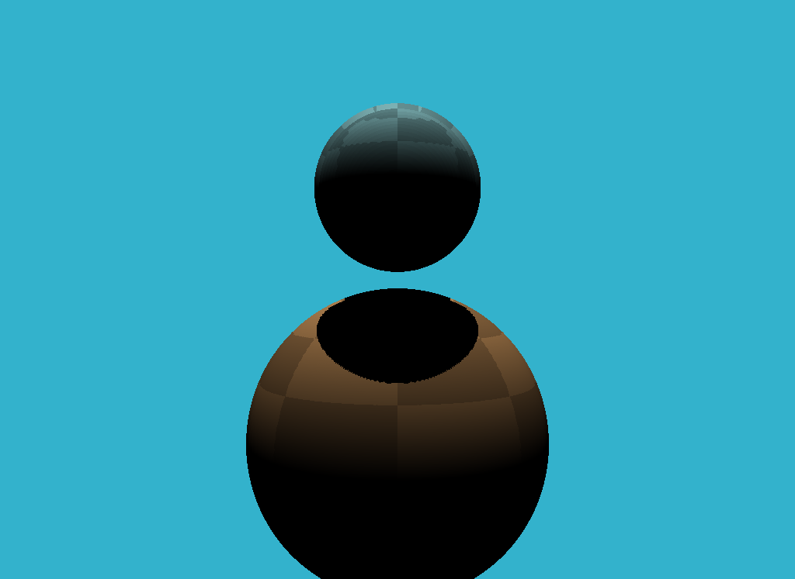
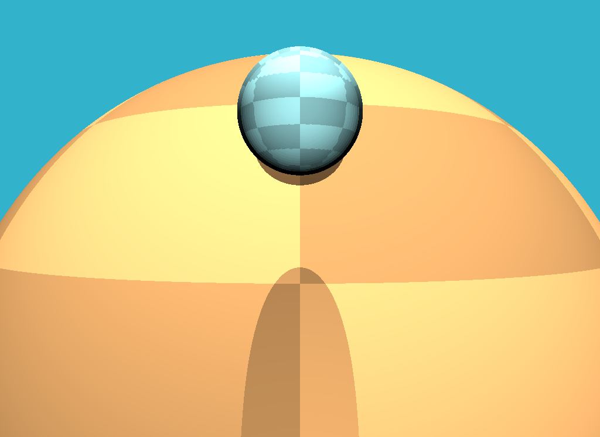
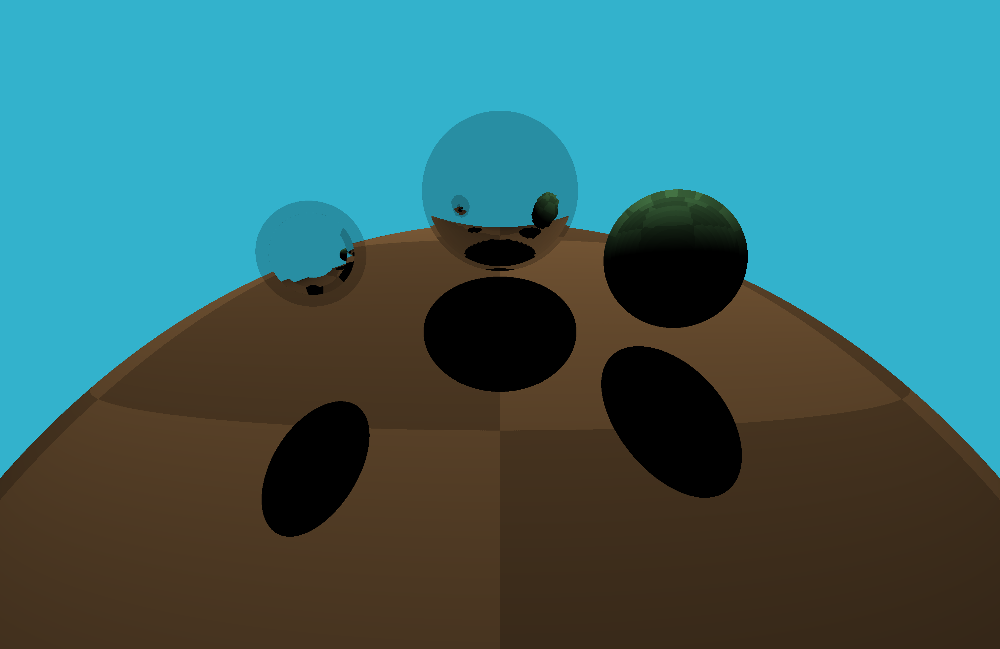
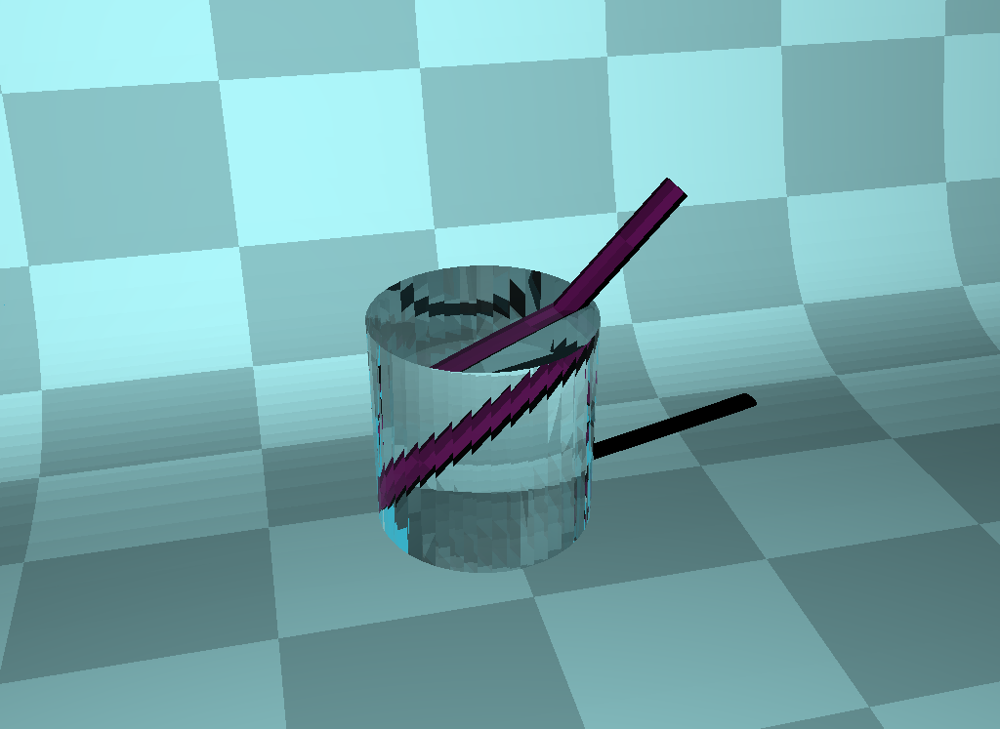
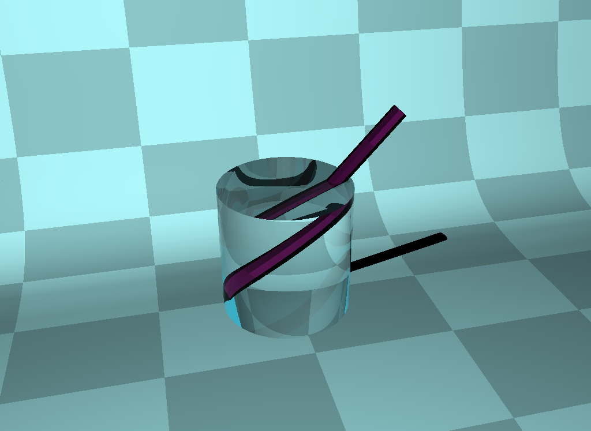

# myGL
1. The simplest ray tracer is finished in v0.1, and it can be downloaded in https://github.com/hudongyue1/myGL/archive/refs/tags/lesson.zip
  
  The related post is [Scratchapixel: Simple Ray Tracing | HDY blog](https://hudongyue.com/2022/12/15/Scratchapixel-Simple-Ray-Tracing/)
  
  It can render the image like:

  

2. The ray tracer v0.2, and it can support to render the triangle mesh. It can be downloaded in https://github.com/hudongyue1/myGL/releases/tag/lesson1
  
  With a mesh model, it can triangulate it at first, then it can render it like:

  

Adding the choice for **Flat Shading** and **Smooth Shading**:

<table frame=void>	<!--用了
进行封装-->
	<tr>
        <td>

	<!--每个格子内是图片加标题-->
        		<!--高度设置-->
        	Flat-Shading	<!--标题1-->
        

</td>    
     	<td>

	<!--第二张图片-->
    			
    		Smooth-Shading
        

</td>
	</tr>
</table>

3. The ray tracer v0.3, add some effects for direct illumination. The related post is [Scratchapixel: Light and Shading | HDY blog](https://hudongyue.com/2022/12/23/Scratchapixel-Light-and-Shading/)

   * Distance light, point light and shadow

   
<table frame=void>	<!--用了
进行封装-->
   	<tr>
           <td>

	<!--每个格子内是图片加标题-->
           		<!--高度设置-->
           	Shadow1	<!--标题1-->
           

</td>    
        	<td>

	<!--第二张图片-->
       			
       		Shadow2
           

</td>
   	</tr>
   </table>

   * Several light

     

   * Reflection

     

   * Reflection and refraction

     
<table frame=void>	<!--用了
进行封装-->
     	<tr>
             <td>

	<!--每个格子内是图片加标题-->
             		<!--高度设置-->
             	Without Smooth Shading	<!--标题1-->
             

</td>    
          	<td>

	<!--第二张图片-->
         			
         		With Smooth Shading
             

</td>
     	</tr>
     </table>

     
